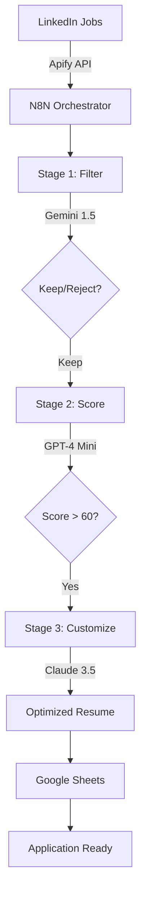

# 🤖 AI Job Search Agent

**Automate your job search with intelligent AI orchestration - from 20 minutes to 2 minutes per application**

## 🎯 Problem & Solution

### The Problem
- **20 minutes** per job application (customization, tracking, submission)
- **60 applications/week** maximum capacity
- **80% of opportunities** missed due to manual discovery
- **70% ATS rejection** due to poor keyword optimization

### The Solution
An intelligent job search pipeline that:
- 🔍 **Discovers** jobs automatically from LinkedIn (100/batch)
- 🎯 **Filters** using AI to match your experience level (92% accuracy)
- 📊 **Scores** compatibility on a 0-100 scale
- ✏️ **Customizes** resumes with ATS-optimized keywords (85% match rate)
- 📈 **Tracks** everything in a centralized dashboard

## 🚀 Key Results

| Metric | Before | After | Improvement |
|--------|--------|-------|-------------|
| **Application Time** | 20 minutes | 2 minutes | **10x faster** |
| **Weekly Capacity** | 60 apps | 250+ apps | **4.2x more** |
| **Keyword Match** | 45% | 85% | **+89%** |
| **Discovery Coverage** | 20% | 90% | **4.5x wider** |
| **Cost per Application** | - | $0.06 | **Minimal** |

## 🏗️ System Architecture



## 💡 Key Features

### 🧠 Multi-Model AI Orchestration
Different AI models for different tasks - optimizing for cost and performance:
- **Gemini 1.5 Flash**: High-volume filtering ($0.001/job)
- **GPT-4 Mini**: Compatibility scoring ($0.01/job)  
- **Claude 3.5 Haiku**: Resume customization ($0.04/resume)

### 📊 Intelligent Scoring Algorithm
```python
Compatibility Score = 
    40% * Required Skills Match +
    30% * Experience Level Fit +
    20% * Industry Relevance +
    10% * Nice-to-Have Skills
```

### 🎯 Smart Filtering Rules
- ✅ **Accept**: 0-4 years experience, entry/mid-level roles
- ❌ **Reject**: Senior/Lead/Principal titles, 5+ years required
- ✅ **Focus**: Full-time positions only
- ❌ **Skip**: Contract, part-time, internships

## 🛠️ Tech Stack

- **Orchestration**: N8N (self-hosted workflow automation)
- **Job Scraping**: Apify (LinkedIn data extraction)
- **AI Models**: 
  - Google Gemini API
  - OpenAI GPT-4 API
  - Anthropic Claude API
- **Data Storage**: Google Sheets API
- **Infrastructure**: Node.js 18+, 2GB VPS

## 📦 Installation & Setup

### Prerequisites
- N8N instance (self-hosted or cloud)
- API keys for:
  - Apify (LinkedIn scraping)
  - Google Gemini
  - OpenAI
  - Anthropic Claude
  - Google Sheets

### Quick Start

1. **Clone the repository**
```bash
git clone https://github.com/yourusername/ai-job-search-agent.git
cd ai-job-search-agent
```

2. **Import N8N workflow**
```bash
# Import the JSON workflow into your N8N instance
n8n import:workflow --input=workflow/job-search-agent.json
```

3. **Configure credentials**
- Add API keys in N8N credentials manager
- Link Google Sheets for data storage
- Set up resume and profile documents

4. **Customize filtering criteria**
```javascript
// Edit in Job Filter node
const experienceRange = "0-4 years";
const excludeTitles = ["Senior", "Lead", "Principal", "Director"];
const employmentType = "Full-time";
```

5. **Run your first batch**
- Add LinkedIn job search URL
- Execute workflow
- Monitor results in Google Sheets

## 📊 Workflow Configuration

### Input Documents Required
1. **Resume** (Google Docs): Your master resume
2. **Profile** (Google Docs): Extended professional profile
3. **LinkedIn URL**: Job search with your filters

### Output Structure
```
Google Sheets Columns:
- Job Details (title, company, location)
- Compatibility Metrics (score, skills match)
- Customized Content (summary, bullets)
- Application Tracking (status, response)
```

## 💰 Cost Analysis

| Component | Cost per 100 Jobs |
|-----------|-------------------|
| N8N Platform | $0.20 ($6/month) |
| Gemini API | $0.10 |
| GPT-4 API | $0.50 |
| Claude API | $1.20 |
| **Total** | **$2.00** |

**Cost per application: ~$0.06** (assuming 30% pass rate)

## 📈 Product Roadmap

### ✅ Completed (MVP)
- [x] LinkedIn job scraping
- [x] AI-powered filtering
- [x] Compatibility scoring
- [x] Resume customization
- [x] Google Sheets tracking

### 🚧 In Progress
- [ ] Response rate tracking
- [ ] A/B testing framework
- [ ] Performance analytics

### 🔮 Future Enhancements
- [ ] Indeed integration
- [ ] Glassdoor support
- [ ] Auto-follow-up sequences
- [ ] Interview scheduling
- [ ] Multi-user support
- [ ] SaaS platform

## 📚 Documentation

- https://drive.google.com/file/d/1kF8fociGMZzVwJI__yW__q9rYPUmlGlE/view?usp=sharing - Detailed PM case study
- https://drive.google.com/file/d/1im4gr4BB39BFyQECCu5zXIm8uajtxUmS/view?usp=sharing - Product Requirements Document


## 🎯 Use Cases

### For Job Seekers
- Maximize application volume without sacrificing quality
- Never miss relevant opportunities
- Optimize resume for each role automatically
- Track all applications in one place

### For Product Managers
- Demonstrates 0-to-1 product building
- Shows technical depth and AI integration
- Proves data-driven decision making
- Portfolio piece for PM applications

## 🤝 Contributing

While this is a personal project, I'm open to collaboration! Feel free to:
- Open issues for bugs or features
- Submit PRs for improvements
- Fork for your own job search
- Star if you find it helpful!

## 📄 License

Feel free to use and modify for your job search!

## 🙋‍♂️ About

Built by Jeevan Ksheerasagar Krishna - Product Manager with a builder mindset.

**Why I built this**: I faced the same job search challenges every PM faces. Instead of just managing the problem, I built a solution. This project demonstrates my approach to product management: identify real problems, build solutions, measure impact, and iterate.

**Key PM Skills Demonstrated**:
- 🎯 Problem identification and sizing
- 👥 User research and journey mapping
- 🏗️ Technical architecture design
- 📊 Data-driven decision making
- 🚀 0-to-1 product development
- 📈 Metrics and optimization

## 📬 Contact

- LinkedIn: https://www.linkedin.com/in/jeevan-ksheerasagar-k 
- Email: jeevan.ksheerasagar.k@gmail.com
- Portfolio: https://sites.google.com/view/jeevanksheerasagar/home
---

**Currently tracking response rates to validate 3x improvement hypothesis. Results available in 2-4 weeks.*
